<!-- Improved compatibility of back to top link: See: https://github.com/othneildrew/Best-README-Template/pull/73 -->

<a name="readme-top"></a>

<!--
*** Thanks for checking out the Best-README-Template. If you have a suggestion
*** that would make this better, please fork the repo and create a pull request
*** or simply open an issue with the tag "enhancement".
*** Don't forget to give the project a star!
*** Thanks again! Now go create something AMAZING! :D
-->

<!-- PROJECT SHIELDS -->
<!--
*** I'm using markdown "reference style" links for readability.
*** Reference links are enclosed in brackets [ ] instead of parentheses ( ).
*** See the bottom of this document for the declaration of the reference variables
*** for contributors-url, forks-url, etc. This is an optional, concise syntax you may use.
*** https://www.markdownguide.org/basic-syntax/#reference-style-links
-->

[![Contributors][contributors-shield]][contributors-url]
[![Forks][forks-shield]][forks-url]
[![Stargazers][stars-shield]][stars-url]
[![Issues][issues-shield]][issues-url]
[![MIT License][license-shield]][license-url]
[](https://www.facebook.com/Minhatt048/)

<!-- PROJECT LOGO -->
<br />
<div align="center">
  <a href="https://diligent.vercel.app/">
    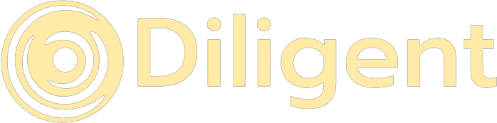
  </a>
  <h3 align="center">
   Social Media for self learning and fulfilling your potential
    <br />
    <a href="https://github.com/Minhnhat0408/Diligent/issues">Report Bug</a>
    ·
    <a href="https://github.com/Minhnhat0408/Diligent/issues">Request Feature</a>
  </h3>
  <p> Note that the responsive is not completed so if you using a small screen device (~14inch) just zoom out a little.</p>
</div>

<!-- TABLE OF CONTENTS -->
<details>
  <summary>Table of Contents</summary>
  <ol>
    <li>
      <a href="#about-the-project">About Diligent</a>
      <ul>
        <li><a href="#built-with">Built With</a></li>
      </ul>
    </li>
    <li><a href="#my_role">My Role</a></li>
    <li><a href="#feature">Feature</a></li>
    <li><a href="#roadmap">Clone and Installation</a></li>
    <li><a href="#contributing">Contributing</a></li>
    <li><a href="#license">License</a></li>
    <li><a href="#contact">Contact</a></li>
  </ol>
</details>

<!-- ABOUT THE PROJECT -->

## About The Project

Diligent is a learning social media platform where everyone can be both teacher and student to other by asking questions and connect with people who contribute unique insights and quality answers. Moreover, The platform also offer many tools and utilities to aid the learning process, so look no further and join our community Diligent.

Benefits:

-   Connect everyone around the world to solve all the problems
-   Bring up motivation by streaks and rewards systems with fun activities through out the learning process
-   Express your idea, project and improve your overall insights

<p align="right">(<a href="#readme-top">back to top</a>)</p>

## My Role
- I'm the leader and fullstack dev of this project. Despite the fact that there is 4 other contributor in this project, all the work is actually done by myself (You can check in the contribution ). This is my spirit child, and I devote all I have in it, however there are still many bugs and feature I want to develop in the future so hopefully you guys can support me. Thanks alot
### Built With

-   
-   
-   
-   
-   
-   
-   

<p align="right">(<a href="#readme-top">back to top</a>)</p>

<!-- GETTING STARTED -->
<!-- ## Getting Started

This is an example of how you may give instructions on setting up your project locally.
To get a local copy up and running follow these simple example steps.

### Prerequisites

This is an example of how to list things you need to use the software and how to install them.
* npm
  ```sh
  npm install npm@latest -g
  ```

### Installation

_Below is an example of how you can instruct your audience on installing and setting up your app. This template doesn't rely on any external dependencies or services._

1. Get a free API Key at [https://example.com](https://example.com)
2. Clone the repo
   ```sh
   git clone https://github.com/your_username_/Project-Name.git
   ```
3. Install NPM packages
   ```sh
   npm install
   ```
4. Enter your API in `config.js`
   ```js
   const API_KEY = 'ENTER YOUR API';
   ```

<p align="right">(<a href="#readme-top">back to top</a>)</p> -->

<!-- USAGE EXAMPLES -->
<!-- ## Usage

Use this space to show useful examples of how a project can be used. Additional screenshots, code examples and demos work well in this space. You may also link to more resources.

_For more examples, please refer to the [Documentation](https://example.com)_

 -->

<!-- FEATURE -->

## Feature

**1. Sign in/Sign up with Google, Facebook or traditionally:**
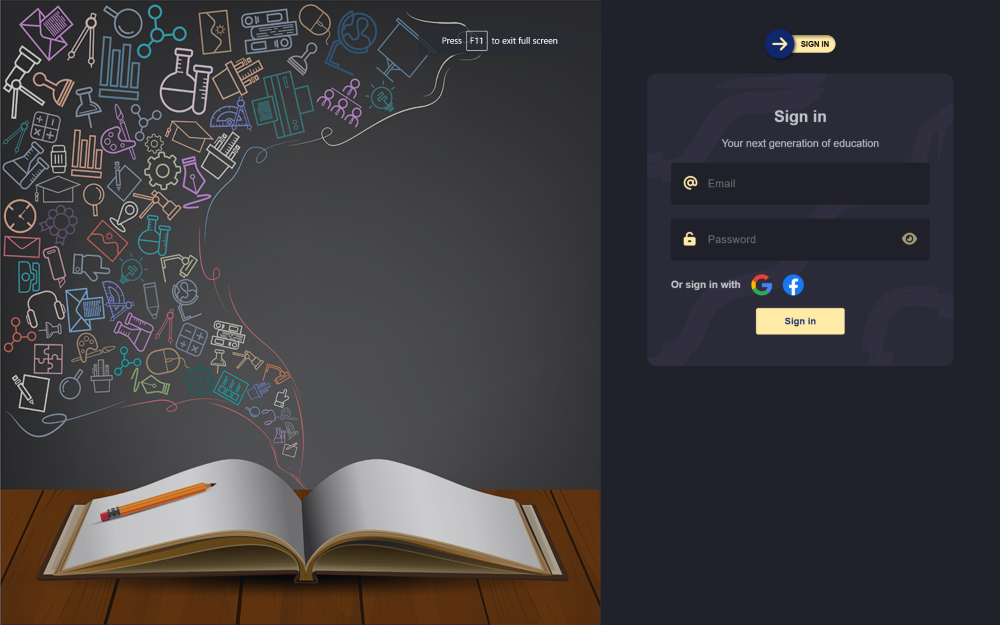

**2. If create a fresh account you will need to fill in the information:**

 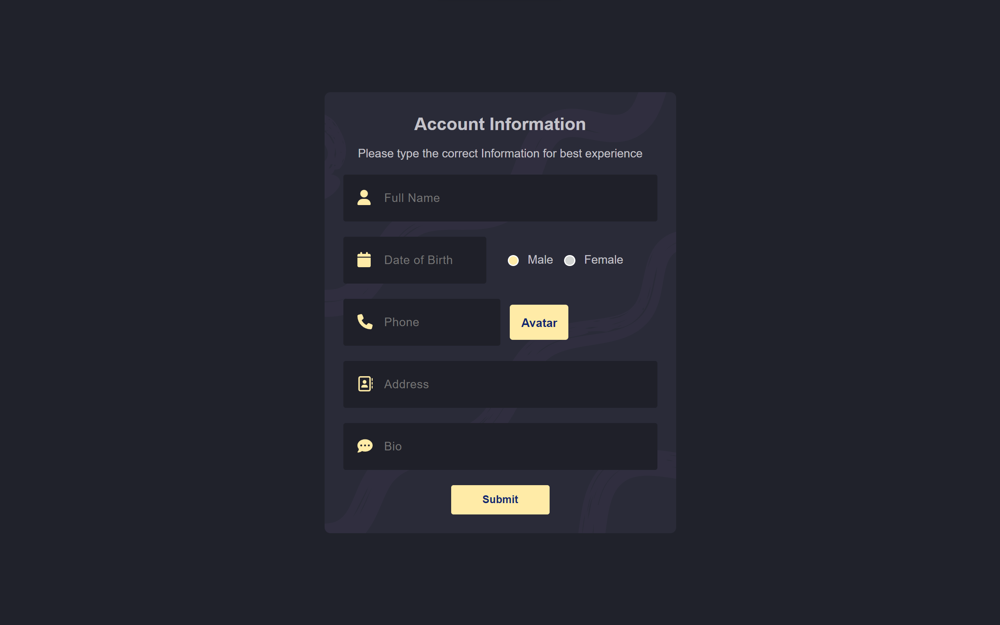

**3. Posting question and idea:**

-   All basic function: post,delete , update, like, comment, save, hide, post.
-   The post will be suggested based on user preference (Category points). Hence your post will be seen by all the users who interests or have skill related. Also we suggested some friends in case you feel lonely :)
    

-   You can also mention a specific person in your post.
    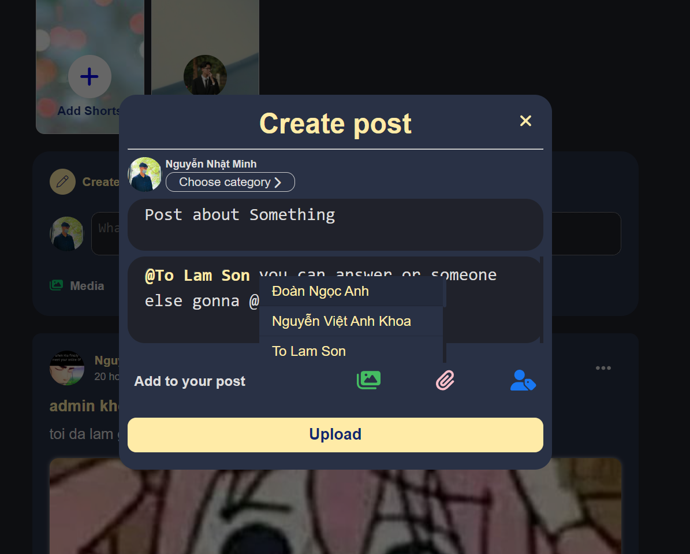

-   Select a specific comment that is corrected or solved your problem.
    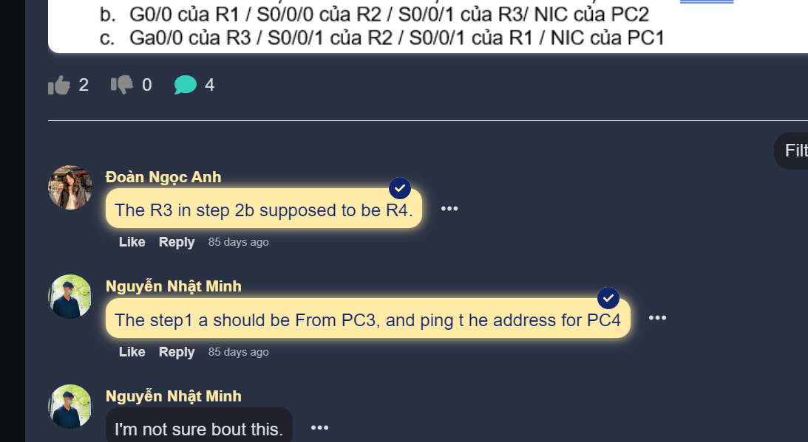

**4. User's Profile :**

-   Information of user, all user's posts and rating for system badges.
    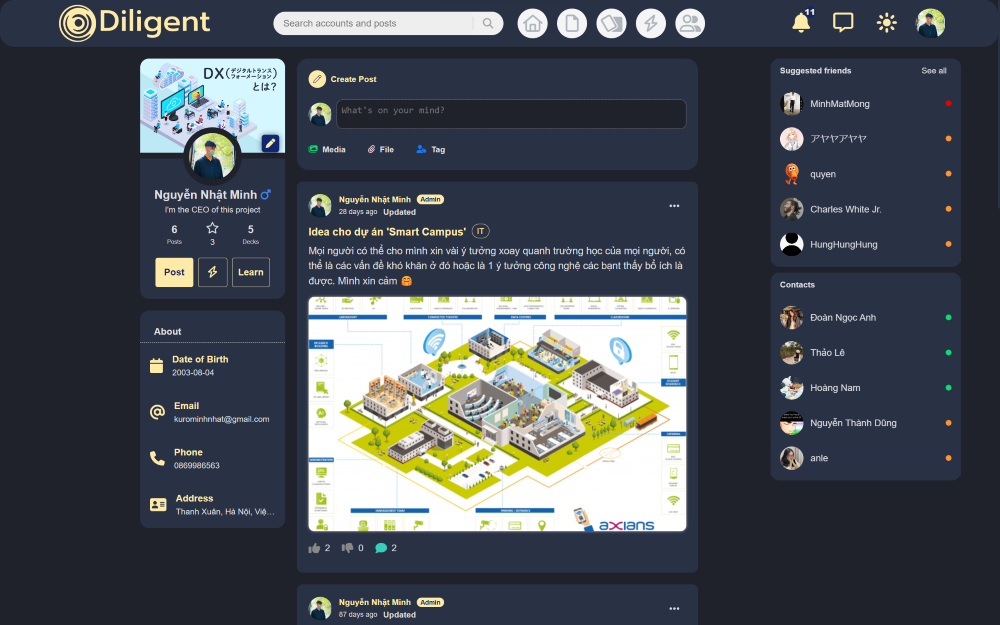

**5. Chat:**

-   Chat page just like messenger and a chat shortcut for recent contact and notify if there is a messsage comming.
<div style="display:flex;justify-content:space-evenly;">
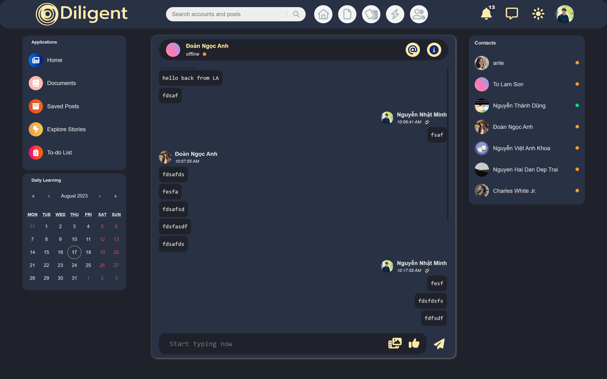
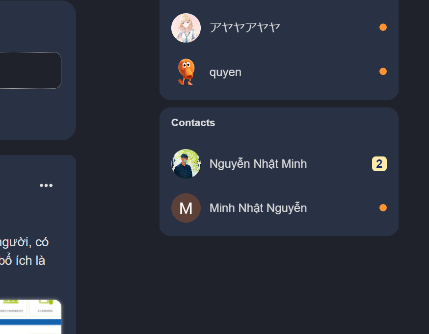
</div>

**6. Document's Storage:**

-   Where everyone can upload their document, so that people can find and use.
-   All basic function like upload, delete, filter, search documents.
    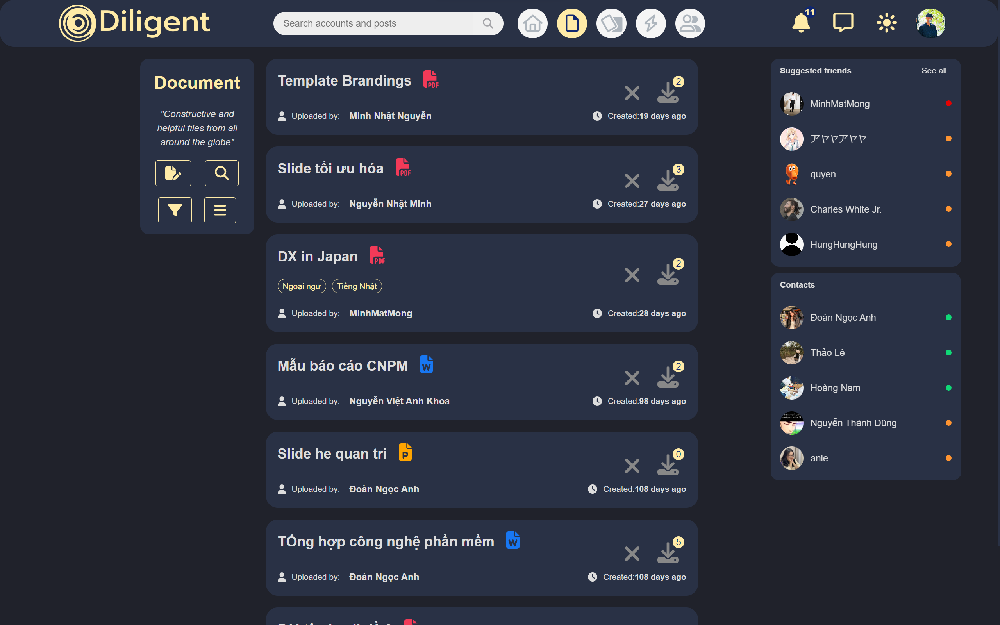

**7. FlashCards:**

-   Upload your decks of card that you want to learn.

    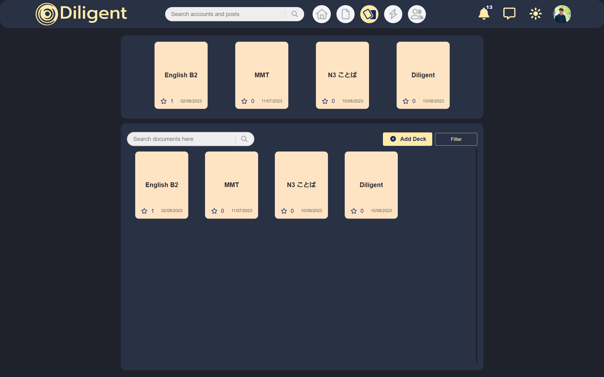

-   Learning space with minimal distraction and user friendly UI.
-   The SRS algorithm (Anki's algo) is implemented to make sure you remember all the information with better UI than Anki.

    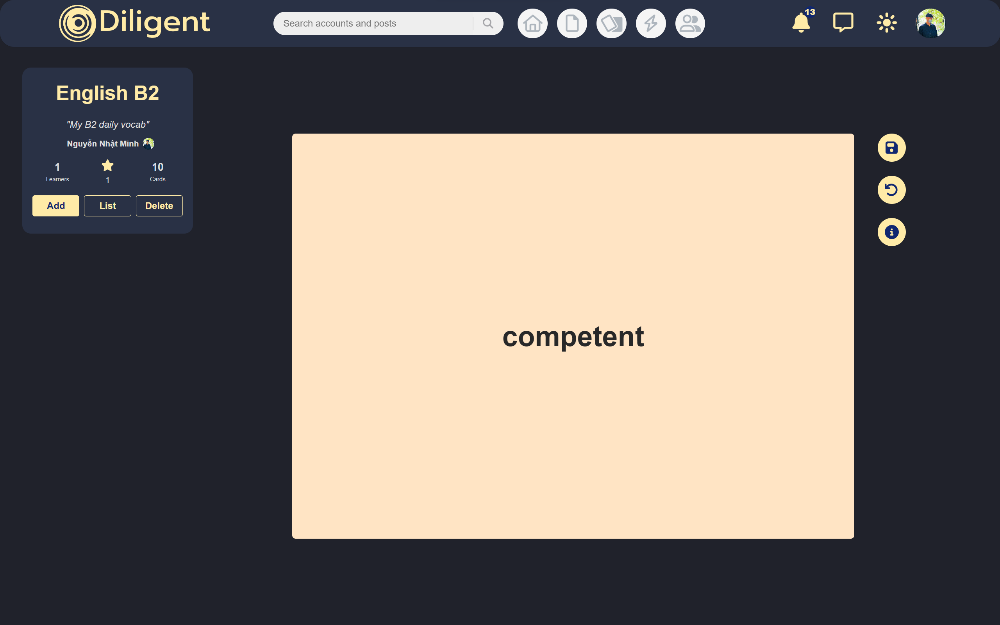

**8. Shorts:**

-   Same like an stories from facebook but used for posting short and informative video.
-   Or just a place to flex some score and achievements.
-   Note that all shorts is expired after 24hr.

<div style="display:flex;justify-content:space-evenly;">
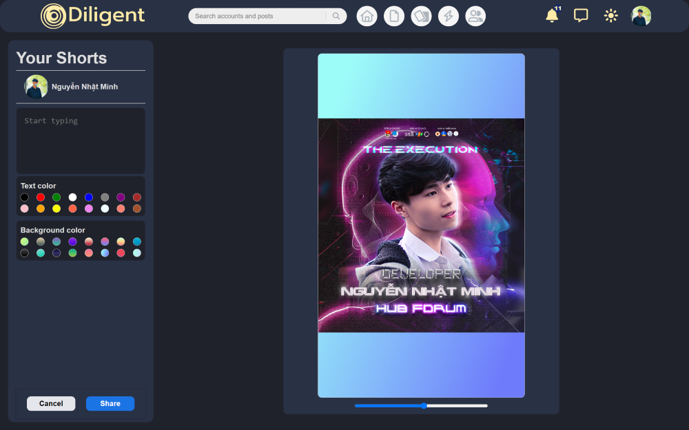
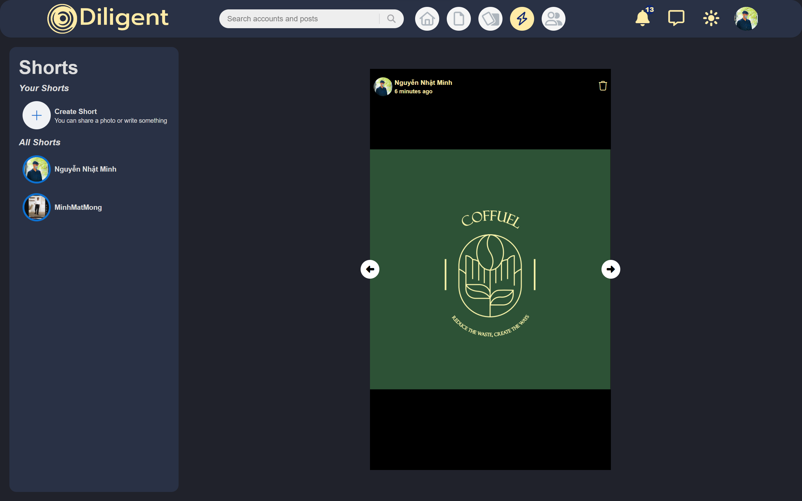
</div>

**9. Todo List:**

-   List of tasks you will do today. You can add and reposition them for the priority. Note that all tasks will be delete after a day.
-   If the tasks can't be finish within that day, you can archived it until you finish or delete it.

<p align="center">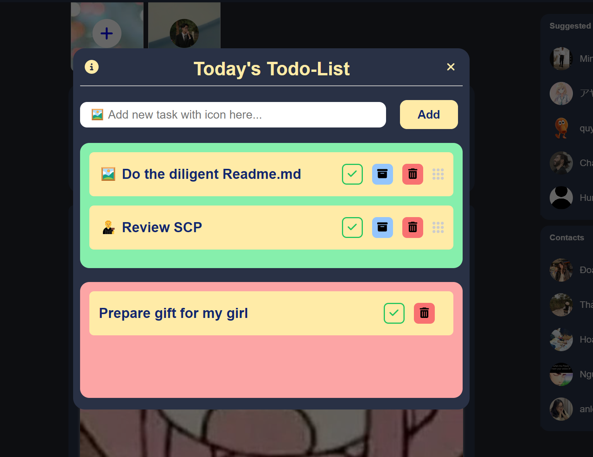</p>


**10. Streak record:**

-   When you finish all the task in today(not delete them), that day will be counted as a productive day.

    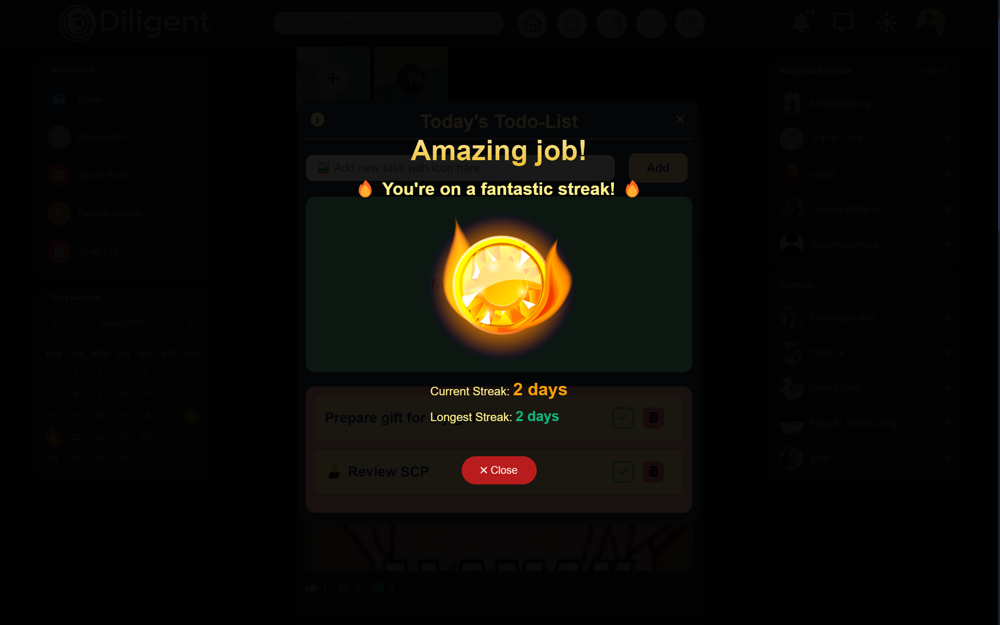

-   It will show your streak on the calendar.

    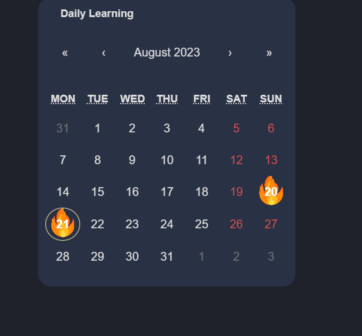


 <p align="right">(<a href="#readme-top">back to top</a>)</p>
<!-- ROADMAP -->

## Roadmap

-   [x] Add Flashcard Algorithm
-   [x] Add Recommended Posts
-   [x] Add Todo-list
-   [ ] Add firebase cloud function to delete realtime
-   [ ] Multi-language Support
    -   [ ] Vietnamese
    -   [x] English

<p align="right">(<a href="#readme-top">back to top</a>)</p>

<!-- CONTRIBUTING -->

## Contributing

Contributions are what make the open source community such an amazing place to learn, inspire, and create. Any contributions you make are **greatly appreciated**.

If you have a suggestion that would make this better, please fork the repo and create a pull request. You can also simply open an issue with the tag "enhancement".
Don't forget to give the project a star! Thanks again!

1. Fork the Project
2. Create your Feature Branch (`git checkout -b feature/AmazingFeature`)
3. Commit your Changes (`git commit -m 'Add some AmazingFeature'`)
4. Push to the Branch (`git push origin feature/AmazingFeature`)
5. Open a Pull Request

<p align="right">(<a href="#readme-top">back to top</a>)</p>

<!-- LICENSE -->

## License

Distributed under the MIT License. See `LICENSE.txt` for more information.

<p align="right">(<a href="#readme-top">back to top</a>)</p>

<!-- CONTACT -->

## Contact

Nguyễn Nhật Minh - [@Minhatt048](https://www.facebook.com/Minhatt048/) - kurominhnhat@gmail.com

Project Link: [https://github.com/Minhnhat0408/Diligent](https://github.com/Minhnhat0408/Diligent)

<p align="right">(<a href="#readme-top">back to top</a>)</p>

<!-- MARKDOWN LINKS & IMAGES -->
<!-- https://www.markdownguide.org/basic-syntax/#reference-style-links -->

[contributors-shield]: https://img.shields.io/github/contributors/Minhnhat0408/Diligent.svg?style=for-the-badge
[contributors-url]: https://github.com/Minhnhat0408/Diligent/graphs/contributors
[forks-shield]: https://img.shields.io/github/forks/Minhnhat0408/Diligent.svg?style=for-the-badge
[forks-url]: https://github.com/Minhnhat0408/Diligent/network/members
[stars-shield]: https://img.shields.io/github/stars/Minhnhat0408/Diligent.svg?style=for-the-badge
[stars-url]: https://github.com/Minhnhat0408/Diligent/stargazers
[issues-shield]: https://img.shields.io/github/issues/Minhnhat0408/Diligent.svg?style=for-the-badge
[issues-url]: https://github.com/Minhnhat0408/Diligent/issues
[license-shield]: https://img.shields.io/github/license/Minhnhat0408/Diligent.svg?style=for-the-badge
[license-url]: https://github.com/Minhnhat0408/Diligent/blob/master/LICENSE.txt
[product-screenshot]: images/screenshot.png
[React.js]: https://img.shields.io/badge/React-20232A?style=for-the-badge&logo=react&logoColor=61DAFB
[React-url]: https://reactjs.org/
